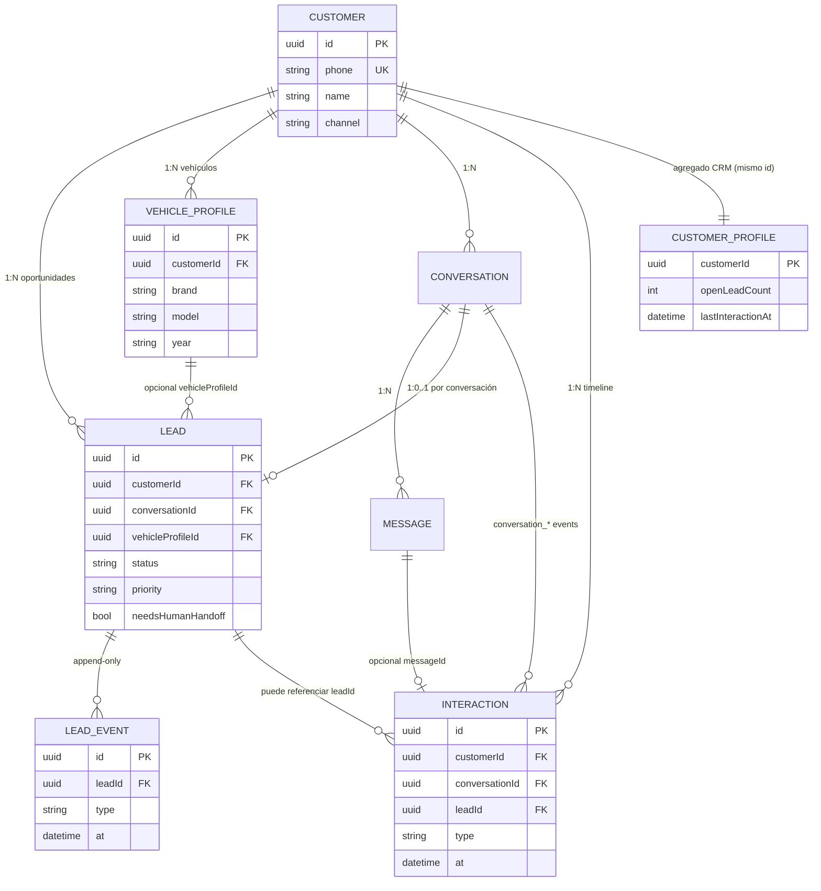
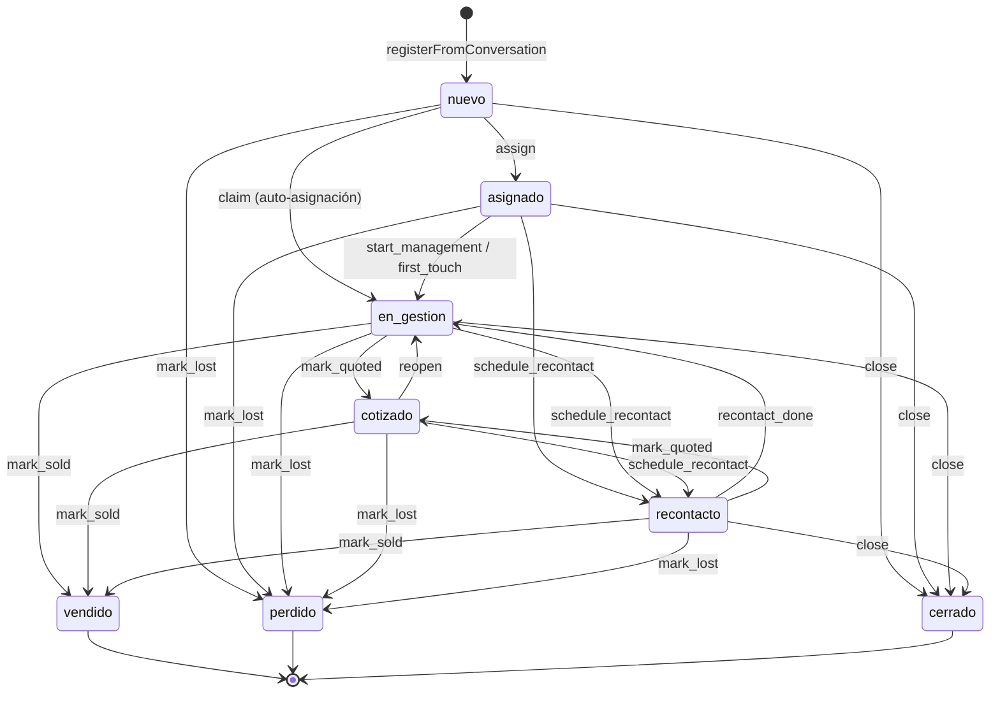
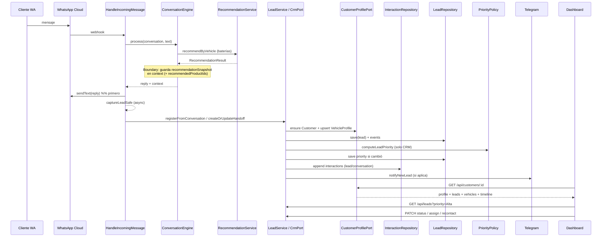

# Rodacenter AI — Especificación técnica CRM (Fase 3)

**Producto:** Rodacenter AI (WhatsApp Business · Rodacenter Manizales)  
**Documento:** fuente de verdad de **diseño** de Fase 3 CRM  
**Estado:** diseño para revisión — **aprobado con enmiendas** — **sin implementación**  
**Actualizado:** 2026-07-29 (enmiendas: CustomerProfile, historial de interacciones, prioridad de lead)  
**Roadmap:** `docs/RODACENTER_AI_ROADMAP.md` (Fase 3)  
**Contratos relacionados:** `docs/WILLARD_INTEGRATION_SPEC.md` §12.3 · `docs/SYSTEM_PROMPT.md` (handoff / no inventar)

---

## 1. Objetivo

Capturar oportunidades calificadas (cliente + contexto conversacional + resultado de recomendación) y entregarlas al equipo humano vía Telegram y panel, **sin** contaminar el motor Willard ni inventar precio/stock.

El CRM MVP debe:

1. Separar **identidad de cliente** (`Customer` / `CustomerProfile`) de **oportunidad** (`Lead`): un cliente puede tener N leads y N vehículos a lo largo del tiempo.
2. Unificar datos de cliente entre conversación, lead y panel sobre un perfil canónico por teléfono.
3. Exponer historial cronológico de interacciones (conversaciones / mensajes / eventos CRM) en el dashboard.
4. Enriquecer el handoff con `reasonCode`, `query` y `options` capturados en el **límite** (boundary), sin cambiar `RecommendationService`.
5. Persistir vía puertos (`LeadRepository` / `CustomerProfilePort` / futuro `CrmPort`); memoria sigue siendo adaptador válido hasta cablear PostgreSQL.
6. Introducir prioridad de lead (`Alta` \| `Media` \| `Baja`) calculada **solo** con reglas CRM, más un subconjunto de estados con asignación, SLA y recontacto **extensible**.

---

## 2. Principios y restricciones

| ID | Regla |
|---|---|
| **C1** | Nunca inventar producto, precio, stock ni equivalencias en campos CRM. |
| **C2** | `RecommendationService`, catálogo Willard, matching y `batteryFlow` **no se modifican** en esta fase de diseño ni en la implementación MVP del CRM. |
| **C3** | Enriquecimiento Willard = post-proceso / captura en boundary (P8). |
| **C4** | Clean Architecture: entidades → servicios de aplicación → puertos → adaptadores → rutas HTTP. |
| **C5** | WhatsApp responde primero; CRM/Telegram son fire-and-forget (ya vigente en `HandleIncomingMessage`). |
| **C6** | Preferir handoff a afirmar dato dudoso (`SYSTEM_PROMPT` + roadmap). |
| **C7** | `InMemoryLeadRepository` permanece adaptador válido hasta PG. |
| **C8** | `Lead` **no** es la identidad del cliente. Identidad canónica = teléfono en `Customer` / perfil CRM. |
| **C9** | Prioridad de lead se calcula **solo** con señales CRM; **nunca** re-consulta Willard ni `RecommendationService`. |

Fuera de alcance detallado: §15.

---

## 3. Estado actual (as-is)

### 3.1 Qué existe

| Pieza | Ubicación | Rol hoy |
|---|---|---|
| Entidad `Lead` | `src/domain/entities/Lead.ts` | Campos básicos + `status` |
| Puerto `LeadRepository` | `src/domain/ports/LeadRepository.ts` | list / find / save / updateStatus |
| Adaptador memoria | `src/infrastructure/persistence/InMemoryLeadRepository.ts` | Persistencia efímera |
| `LeadService` | `src/application/services/LeadService.ts` | `registerFromConversation` + Telegram BG |
| `NotificationService` | `src/application/services/NotificationService.ts` | Alerta Telegram lead nuevo |
| API HTTP | `GET/PATCH /api/leads` vía `leadRoutes.ts` | Panel |
| Dashboard | `dashboard/` | Lista + cambio de estado |
| Disparo | `HandleIncomingMessage.captureLeadSafe` | Tras enviar WhatsApp |
| Cliente | `Customer` + `CustomerRepository` (memoria) | `findOrCreate` por teléfono |
| Schema PG preparado | `schema.sql` | `customers` / `conversations` / `messages`… **sin** `leads`, `vehicle_profiles`, `interactions` |

### 3.2 Gaps vs Fase 3 pendiente

- `Lead` mezcla oportunidad con datos de identidad; no hay modelo explícito de perfil 1→N leads / vehículos.
- No hay snapshot de `RecommendationResult` (`outcome`, `reasonCode`, `query`, `options`).
- `Lead.recommendation` es string derivado de IDs o emojis del reply — pierde trazabilidad.
- Estados comerciales simples (`nuevo` \| `cotizado` \| `vendido` \| `perdido`); sin asignación, SLA, recontacto ni prioridad.
- Sin eventos / auditoría de ciclo de vida del lead.
- Sin timeline de interacciones unificada para el dashboard (aunque `conversations` + `messages` ya están en `schema.sql`).
- `schema.sql` no modela leads / vehículos CRM / interacciones; no hay `CrmPort`.
- Datos de cliente duplicados implícitos (`Lead.name`/`phone` vs `Customer`) sin contrato unificado.
- `handoffReason` conversacional no se persiste en el lead.

---

## 4. Arquitectura objetivo (to-be)

```text
WhatsApp Cloud API
  → HandleIncomingMessage
      → ConversationEngine (+ batteryFlow / bearingFlow)   [sin cambios de matching]
      → MessagingProvider.sendText                         [primero]
      → LeadService.registerFromConversation (async)       [CRM boundary]
            → CustomerRepository / CustomerProfilePort
            → LeadRepository (memoria | futuro PG)
            → InteractionRepository (append-only timeline)
            → (opcional) CrmPort.emit / createHandoff
            → PriorityPolicy.recompute (solo señales CRM)
            → NotificationService (Telegram)
      → Dashboard ← GET /api/customers/:id|phone + /api/leads*
```

Capas:

| Capa | Responsabilidad CRM |
|---|---|
| **Domain** | `Customer`, `CustomerProfile` (agregado CRM), `VehicleProfile`, `Lead`, `LeadEvent`, `Interaction`, enums, invariantes; puertos `LeadRepository`, `CustomerProfilePort`, `InteractionRepository`, `CrmPort` |
| **Application** | `LeadService`, `CustomerProfileService` (perfil + timeline), políticas de prioridad / SLA / state machine |
| **Infrastructure** | Repos en memoria; futuros adaptadores PG; Telegram adapter |
| **Presentation** | `leadRoutes`, `customerRoutes`, DTOs HTTP; dashboard consume API |

**Boundary de captura Willard (importante):**  
Tras `recommendByVehicle` / formateo, el motor (o un mapper en application **fuera** de `RecommendationService`) debe dejar en `ConversationContext` un snapshot serializable `recommendationSnapshot`. `LeadService` solo lee ese snapshot + contexto; **no** vuelve a llamar al motor de matching. La prioridad del lead **no** usa ese snapshot para re-ejecutar matching; solo puede leer campos **ya persistidos** en el lead (p. ej. `needsHumanHandoff`, o `recommendationSnapshot.outcome` si se usa como señal CRM congelada — ver §8).

---

## 5. Modelo de dominio

### 5.0 Decisión Clean Architecture: `Customer` vs `CustomerProfile`

| Enfoque evaluado | Decisión |
|---|---|
| Renombrar `Customer` → `CustomerProfile` en dominio | **Rechazado** para el MVP: rompería `CustomerRepository`, `schema.sql.customers`, conversaciones y código existente sin beneficio. |
| Introducir `CustomerProfile` como agregado CRM que **envuelve / extiende** `Customer` | **Adoptado.** |

**Por qué:**

- `Customer` ya es la entidad de **identidad** (teléfono único) en dominio + `schema.sql`.
- El CRM necesita un **agregado de lectura/escritura de aplicación**: perfil + leads + vehículos + timeline.
- Clean Architecture: la entidad de persistencia de identidad permanece estable; el agregado CRM vive en dominio/aplicación CRM y se arma vía puertos sin duplicar la fila de identidad.

```text
Customer (identidad persistida, phone canónico)
    │
    │  CustomerProfile = vista/agregado CRM sobre el mismo customerId
    │
    ├── 1→N Lead              (oportunidades en el tiempo)
    ├── 1→N VehicleProfile    (vehículos conocidos en el tiempo)
    └── 1→N Interaction       (timeline append-only; ver §7)
```

**Regla de identidad:** `phone` canónico **solo** en `Customer`. Los leads guardan `customerId` + denormalización de lectura (`phone`/`name`) para panel/Telegram. Si divergen, gana `Customer` para identidad y el lead para datos de la oportunidad.

### 5.1 `Customer` (identidad — ya existe)

| Campo | Tipo | Notas |
|---|---|---|
| `id` | `UUID` | Ya existe |
| `phone` | `string` | E.164 / dígitos WA; **único**; canónico |
| `name` | `string \| undefined` | Preferir el más reciente no vacío |
| `channel` | `Channel` | `whatsapp` en MVP |
| `createdAt` / `updatedAt` | `Date` | Ya existen |

Al registrar lead: actualizar `Customer` vía `CustomerRepository.save` cuando cambien nombre/teléfono; no crear un segundo “cliente” por lead.

### 5.2 `CustomerProfile` (agregado CRM)

Contrato de diseño (no código aún). No sustituye la tabla `customers`; es el objeto que consume el panel y la API de perfil.

```ts
interface CustomerProfile {
  /** Mismo id que Customer.id */
  customerId: string;
  phone: string;
  name?: string;
  channel: Channel;
  createdAt: Date;
  updatedAt: Date;

  /** Resumen operativo (calculado al leer o cacheado) */
  openLeadCount: number;
  lastInteractionAt?: Date;
  tags?: string[];           // futuro; vacío en MVP

  leads: LeadSummary[];      // o hidratar completo en detalle
  vehicles: VehicleProfile[];
  /** Timeline unificada; ver §7 — puede paginarse fuera del root */
  interactions?: Interaction[];
}

interface LeadSummary {
  id: string;
  status: LeadStatus;
  priority: LeadPriority;
  product: LeadProduct;
  createdAt: Date;
  needsHumanHandoff: boolean;
}
```

**Puerto:**

```ts
interface CustomerProfilePort {
  getByCustomerId(customerId: string): Promise<CustomerProfile | null>;
  getByPhone(phone: string): Promise<CustomerProfile | null>;
  /** Perfil + leads + vehículos + timeline (paginada) */
  getDetail(params: {
    customerId?: string;
    phone?: string;
    interactionLimit?: number;
    interactionBefore?: Date;
  }): Promise<CustomerProfileDetail | null>;
}

interface CustomerProfileDetail extends CustomerProfile {
  leads: Lead[];
  vehicles: VehicleProfile[];
  interactions: Interaction[];
  interactionsHasMore: boolean;
}
```

Implementación futura: ensambla `CustomerRepository` + `LeadRepository` + `VehicleProfileRepository` + `InteractionRepository` (+ opcionalmente `conversations`/`messages` de PG).

### 5.3 `VehicleProfile` (1→N por cliente)

Vehículos del cliente **a lo largo del tiempo**, independientes del lead. Un lead puede **referenciar** un `vehicleProfileId` opcional y además guardar snapshot denormalizado (marca/modelo/año) de esa oportunidad.

```ts
interface VehicleProfile {
  id: string;
  customerId: string;
  brand: string;
  model: string;
  year?: string;
  version?: string;
  notes?: string;
  /** Origen de alta */
  source: 'whatsapp_flow' | 'advisor' | 'import';
  firstSeenAt: Date;
  lastSeenAt: Date;
  createdAt: Date;
  updatedAt: Date;
}
```

**Reglas MVP:**

- Upsert por clave lógica suave `(customerId, brand, model, year?)` al crear/actualizar lead — no inventar datos Willard.
- No llamar al catálogo; solo persistir lo que el cliente o el asesor ya aportaron.
- Historial: `lastSeenAt` se actualiza; no se borra el vehículo al cerrar un lead.

### 5.4 Lead (MVP enriquecido) — oportunidad, no identidad

Extiende la entidad actual. Campos nuevos marcados ★.  
**Un customer → muchos leads** (abiertos o cerrados). Idempotencia por conversación: una conversación → un lead.

```ts
// Contrato de diseño (no código aún)

type LeadProduct = 'Batería' | 'Rodamiento';

/** Prioridad comercial — etiquetas en español (dominio + API) */
type LeadPriority = 'Alta' | 'Media' | 'Baja';

/** Estados comerciales (pipeline) — ver §6 */
type LeadStatus =
  | 'nuevo'
  | 'asignado'      // ★
  | 'en_gestion'    // ★ (asesor contactó / está cotizando)
  | 'cotizado'      // se mantiene
  | 'recontacto'    // ★ (pendiente de volver a escribir)
  | 'vendido'
  | 'perdido'
  | 'cerrado';      // ★ (cerrado sin venta, distinto de perdido)

type LeadSource = 'whatsapp_flow' | 'whatsapp_handoff' | 'api_test';

type RecommendationOutcomeSnapshot = 'matched' | 'partial' | 'empty' | 'unknown';

interface LeadVehicleQuery {
  marca?: string;
  modelo?: string;
  version?: string;
  year?: string;       // slot conversacional; no implica catálogo Willard
}

/** Opción recomendada — solo literales ya producidos por RecommendationResult */
interface LeadRecommendedOption {
  reference: string;
  productLine?: string;
  /** Trazabilidad si estaba en el result; no inventar */
  fuenteImagen?: string;
  fuenteFila?: number;
}

interface LeadRecommendationSnapshot {
  outcome: RecommendationOutcomeSnapshot;
  reasonCode?: string;           // ej. NO_USABLE_MATCH, AMBIGUOUS_MODEL
  query: LeadVehicleQuery;
  options: LeadRecommendedOption[];
  /** Resumen humano para Telegram/panel; derivado de options o handoffReason — nunca precio/stock inventado */
  summary: string;
}

interface LeadAssignment {
  assigneeId?: string;           // id interno asesor (MVP: string libre / email)
  assigneeName?: string;
  assignedAt?: Date;
}

interface LeadSla {
  firstResponseDueAt?: Date;     // createdAt + SLA_FIRST_RESPONSE_MINUTES
  firstResponseAt?: Date;
  breached?: boolean;
}

interface LeadRecontact {
  dueAt?: Date;
  attempts: number;
  lastAttemptAt?: Date;
  note?: string;
}

interface Lead {
  id: string;
  createdAt: Date;
  updatedAt: Date;               // ★

  // Identidad: referencia al perfil; phone/name = denormalización de lectura
  customerId: string;            // FK lógica → Customer / CustomerProfile
  conversationId: string;
  phone: string;
  name?: string;
  channel: Channel;              // ★ default whatsapp
  source: LeadSource;            // ★

  // Vehículo de esta oportunidad
  vehicleProfileId?: string;     // ★ opcional → VehicleProfile
  product: LeadProduct;
  vehicleBrand: string;
  vehicleModel: string;
  year: string;
  optionLabel: string;           // "Planta de sonido" | "ABS"
  optionValue: boolean | null;

  // Recomendación / handoff (snapshot congelado; no re-query Willard)
  recommendation: string;        // legacy summary (compat panel)
  recommendationSnapshot?: LeadRecommendationSnapshot; // ★
  handoffReason?: string;        // ★ desde ConversationContext
  needsHumanHandoff: boolean;    // ★

  status: LeadStatus;
  priority: LeadPriority;        // ★ ver §8 — almacenada; recalculable
  priorityUpdatedAt?: Date;      // ★
  assignment?: LeadAssignment;   // ★
  sla?: LeadSla;                 // ★
  recontact?: LeadRecontact;     // ★
  notes?: string;                // ★ notas internas asesor

  telegramNotified?: boolean;
  lostReason?: string;           // ★ opcional al pasar a perdido
}
```

**Compatibilidad:** el dashboard actual sigue funcionando con `recommendation` string + estados legacy; `priority`, estados nuevos y perfil se exponen cuando el panel se actualice (Fase 4).

### 5.5 Snapshot desde `RecommendationResult` (boundary)

Mapeo **solo lectura** en el límite (propuesta: mapper `toLeadRecommendationSnapshot(result)` en `application/crm/` o al persistir contexto):

| `RecommendationResult` | Campo lead |
|---|---|
| `outcome` | `recommendationSnapshot.outcome` |
| `reasonCode` | `recommendationSnapshot.reasonCode` |
| `query.marca/modelo/version` | `recommendationSnapshot.query` (+ `year` del contexto conversacional) |
| `options[].reference`, `productLine`, `application.fuente` | `options[]` |
| — | `summary` = join de referencias **o** texto de handoff; **sin** precio/stock |

`reasonCode` conocidos (consumir, no redefinir motor):

- `NO_USABLE_MATCH`
- `AMBIGUOUS_MODEL`
- `VEHICLE_MATCH_WITHOUT_REFERENCES`
- `SPEC_WITHOUT_APPLICATIONS`

Rodamientos (sin Willard tipado igual): `outcome: 'unknown'`, `options` desde `recommendedProductIds`, `reasonCode` opcional alineado a `handoffReason` categorizado (ver §9).

### 5.6 Diagrama ER de dominio (CRM)



---

## 6. Máquina de estados (MVP)

### 6.1 Diagrama



### 6.2 Semántica MVP

| Estado | Quién lo pone | Significado |
|---|---|---|
| `nuevo` | Sistema al crear | Sin dueño; visible en cola |
| `asignado` | API / panel | Tiene `assigneeId`; aún sin primer contacto registrado |
| `en_gestion` | API / panel | Asesor trabajando el caso |
| `cotizado` | API / panel (ya existe) | Cotización enviada al cliente |
| `recontacto` | API / panel | Seguimiento diferido (`recontact.dueAt`) |
| `vendido` | API / panel | Cierre ganado |
| `perdido` | API / panel | Cierre perdido (`lostReason` opcional) |
| `cerrado` | API / panel | Archivado sin clasificar como perdido (spam, prueba, duplicado) |

**Transiciones legacy:** el `PATCH` actual `nuevo → cotizado|vendido|perdido` sigue válido (atajos). Internamente se registran eventos equivalentes. Tras cada transición relevante se recalcula `priority` (§8).

### 6.3 Asignación (MVP)

- `POST /api/leads/:id/assign` con `{ assigneeId, assigneeName? }`.
- `claim`: asigna al solicitante y pasa a `en_gestion` si venía de `nuevo`.
- Un lead solo tiene un assignee a la vez (MVP); reasignación emite `lead.reassigned`.

### 6.4 SLA (MVP subset)

Config (env, no hardcode en dominio):

| Parámetro | Default propuesto | Uso |
|---|---|---|
| `CRM_SLA_FIRST_RESPONSE_MINUTES` | `30` | `sla.firstResponseDueAt = createdAt + N` |
| `CRM_SLA_RECONTACT_HOURS` | `24` | default al programar recontacto sin `dueAt` |

- Al crear lead: inicializar `sla.firstResponseDueAt`.
- Al primer `en_gestion` / evento `lead.first_touch`: set `firstResponseAt`; `breached = firstResponseAt > firstResponseDueAt`.
- Job futuro (Fase 5): listar `breached` / vencidos; **MVP solo calcula y expone flags**, no envía recordatorios automáticos.
- `sla.breached` alimenta prioridad (§8); no dispara Willard.

### 6.5 Recontacto (MVP subset)

- `POST /api/leads/:id/recontact` → estado `recontacto`, incrementa `attempts`, set `dueAt`.
- `POST /api/leads/:id/recontact/done` → vuelve a `en_gestion`.
- Sin cola automática en MVP (solo datos + API).
- Recontacto vencido (`dueAt < now` y status `recontacto`) eleva prioridad (§8).

---

## 7. Historial cronológico de interacciones

El dashboard debe mostrar **todas** las conversaciones / toques previos del cliente, no solo el lead actual.

### 7.1 Modelo `Interaction` (timeline append-only)

```ts
type InteractionType =
  | 'conversation.started'
  | 'conversation.message_in'
  | 'conversation.message_out'
  | 'conversation.closed'
  | 'lead.created'
  | 'lead.status_changed'
  | 'lead.priority_changed'
  | 'lead.assigned'
  | 'lead.handoff'
  | 'lead.note_added'
  | 'lead.recontact_scheduled'
  | 'advisor.manual';     // nota/acción libre del panel

interface Interaction {
  id: string;
  customerId: string;              // obligatorio — ancla al perfil
  at: Date;                        // orden cronológico ASC / DESC
  type: InteractionType;
  channel: Channel;

  conversationId?: string;         // → conversations.id si aplica
  messageId?: string;              // → messages.id si aplica
  leadId?: string;                 // → leads.id si aplica

  /** Texto corto para UI; sin inventar precio/stock */
  summary: string;
  payload?: Record<string, unknown>;

  actor: 'customer' | 'system' | 'advisor' | 'api';
  actorId?: string;
}
```

**Invariantes:**

- Append-only: no update in-place del contenido histórico (correcciones = nuevo evento).
- Orden canónico: `ORDER BY at ASC, id ASC` (desempate estable).
- Desacoplado de Willard: puede incluir refs a `recommendationSnapshot` **ya guardado** en el lead (`payload.leadId` / summary); **nunca** llama a `RecommendationService`.

### 7.2 Relación con `schema.sql` existente

| Fuente actual | Uso en timeline |
|---|---|
| `conversations` | Cada conversación del `customer_id` → entradas `conversation.*` |
| `messages` | Mensajes por `conversation_id` → `conversation.message_in/out` (o proyección lazy) |
| `conversation_logs` | Auditoría operativa; **no** sustituye timeline CRM (puede enriquecer en Fase 5) |
| `leads` / `lead_events` (propuestos) | Eventos comerciales proyectados también como `Interaction` |

**Estrategia MVP (diseño):**

1. **Proyección dual:** al persistir mensaje/lead event, append a `interactions` **o** construir timeline en lectura uniendo `messages` + `lead_events` filtrados por `customerId`.
2. Preferencia de diseño: tabla `interactions` materializada para consultas de panel rápidas; `messages` sigue siendo fuente de verdad del chat.
3. API de perfil siempre devuelve timeline **cronológica** paginada (`before` cursor + `limit`).

### 7.3 Puerto

```ts
interface InteractionRepository {
  append(interaction: Interaction): Promise<Interaction>;
  listByCustomerId(
    customerId: string,
    opts?: { limit?: number; before?: Date; types?: InteractionType[] },
  ): Promise<Interaction[]>;
}
```

---

## 8. Prioridad de lead (`Alta` \| `Media` \| `Baja`)

### 8.1 Contrato

- Valores de dominio/API en **español**: `'Alta' | 'Media' | 'Baja'`.
- Campo almacenado en `Lead.priority` (+ `priorityUpdatedAt`).
- **MUST NOT** depender del motor Willard ni re-ejecutar matching.
- Se calcula **solo** con `PriorityPolicy` (reglas CRM puras) sobre el estado del lead + señales del perfil.

### 8.2 Señales permitidas (CRM-only)

| Señal | Origen | ¿Permitida? |
|---|---|---|
| `needsHumanHandoff` | Lead / contexto ya capturado | Sí |
| `sla.breached` / vencido sin first touch | Lead.sla | Sí |
| Recontacto overdue (`status=recontacto` ∧ `dueAt < now`) | Lead.recontact | Sí |
| `product` (Batería / Rodamiento) | Lead | Sí (peso comercial CRM) |
| `openLeadCount` del mismo customer | CustomerProfile / LeadRepository | Sí (cliente repetido / multi-oportunidad) |
| `status` abierto vs terminal | Lead | Sí (terminales no compiten en cola) |
| `recommendationSnapshot.outcome` | **Solo si ya está snapshotted en el lead** | Uso **opcional y secundario**; preferir señales puras arriba. **Prohibido** re-consultar Willard. |
| Llamar `RecommendationService` / matching / batteryFlow | — | **No** |
| Precio / stock | — | **No** |

### 8.3 Tabla de reglas (propuesta MVP)

Evaluación en orden; gana el **máximo** nivel alcanzado (no se “promedia”). Leads en `vendido` \| `perdido` \| `cerrado` → prioridad informativa `Baja` (fuera de cola activa) salvo override manual futuro.

| # | Condición (CRM) | Prioridad resultante |
|---|---|---|
| R1 | `needsHumanHandoff === true` **y** `status ∈ {nuevo, asignado}` **y** sin `firstResponseAt` | **Alta** |
| R2 | `sla.breached === true` **o** (`firstResponseDueAt < now` ∧ sin first touch) | **Alta** |
| R3 | `status === 'recontacto'` **y** `recontact.dueAt < now` | **Alta** |
| R4 | `openLeadCount >= 2` (mismo `customerId`, leads no terminales) **y** lead actual abierto | **Alta** |
| R5 | `needsHumanHandoff === true` **y** status abierto (no cubierto por R1) | **Media** |
| R6 | `product === 'Batería'` **y** status ∈ `{nuevo, asignado, en_gestion}` (sin R1–R4) | **Media** |
| R7 | Snapshot opcional: `recommendationSnapshot.outcome === 'empty'` **ya persistido** **y** handoff/abierto (sin R1–R4) | **Media** |
| R8 | Resto de leads abiertos | **Baja** |
| R9 | Lead terminal (`vendido` / `perdido` / `cerrado`) | **Baja** |

**Override manual (Fase 4+):** `PATCH` de prioridad por asesor emite `lead.priority_changed` con `actor: advisor`; flag `priorityLocked` opcional fuera de MVP.

### 8.4 Cuándo se calcula / recalcula

| Momento | Acción |
|---|---|
| `lead.created` | Calcular e inicializar `priority` |
| Cambio de `status`, asignación, first touch | Recompute |
| Cambio SLA (`breached` detectado lazy) | Recompute |
| Schedule / done recontacto | Recompute |
| Enrichment que cambie `needsHumanHandoff` o snapshot outcome **ya en lead** | Recompute |
| Lectura de cola (opcional lazy) | Recompute si señales temporales (dueAt/SLA) cambiaron |

Si el valor nuevo ≠ anterior: persistir + emitir `lead.priority_changed` (+ proyección `Interaction` tipo `lead.priority_changed`).

```ts
// application/crm/priorityPolicy.ts (diseño)
function computeLeadPriority(input: {
  lead: Lead;
  openLeadCount: number;
  now: Date;
}): LeadPriority;
```

---

## 9. Eventos de lead

Append-only para auditoría y panel. No sustituyen el estado actual; lo explican. Pueden proyectarse a `Interaction` (§7).

### 9.1 Tipos

| `type` | Cuándo |
|---|---|
| `lead.created` | Primer save |
| `lead.updated` | Enrichment (snapshot, vehículo, nombre) misma conversación |
| `lead.status_changed` | Cualquier cambio de `status` |
| `lead.priority_changed` | Cambio de `priority` (sistema o advisor) |
| `lead.assigned` | Asignación inicial |
| `lead.reassigned` | Cambio de assignee |
| `lead.first_touch` | Primera gestión humana |
| `lead.recontact_scheduled` | Entrada a recontacto |
| `lead.recontact_done` | Salida de recontacto |
| `lead.note_added` | Nota interna |
| `lead.telegram_notified` | Notificación OK |
| `lead.telegram_failed` | Notificación fallida |
| `lead.sla_breached` | Detectado breach (lazy al leer o al tocar) |

### 9.2 Forma

```ts
interface LeadEvent {
  id: string;
  leadId: string;
  type: string;           // ver tabla
  at: Date;
  actor: 'system' | 'advisor' | 'api';
  actorId?: string;
  payload?: Record<string, unknown>;  // diffs acotados; sin PII extra innecesaria
}
```

Persistencia: tabla `lead_events` (PG) o array en memoria junto al lead hasta PG.

---

## 10. Puertos

### 10.1 `LeadRepository` (evolución del existente)

```ts
interface LeadRepository {
  list(filter?: LeadListFilter): Promise<Lead[]>;
  findById(id: string): Promise<Lead | null>;
  findByConversationId(conversationId: string): Promise<Lead | null>;
  findOpenByCustomerId(customerId: string): Promise<Lead[]>; // ★
  findByCustomerId(customerId: string): Promise<Lead[]>;     // ★ historial de oportunidades
  save(lead: Lead): Promise<Lead>;
  updateStatus(id: string, status: LeadStatus): Promise<Lead | null>;
  appendEvent?(event: LeadEvent): Promise<void>;             // ★
  listEvents?(leadId: string): Promise<LeadEvent[]>;         // ★
}

interface LeadListFilter {
  status?: LeadStatus | LeadStatus[];
  priority?: LeadPriority | LeadPriority[];
  product?: LeadProduct;
  from?: Date;
  to?: Date;
  assigneeId?: string;
  customerId?: string;
  outcome?: RecommendationOutcomeSnapshot; // filtro sobre snapshot persistido
  q?: string; // phone / name / brand
}
```

**Adaptadores:**

1. `InMemoryLeadRepository` — válido ahora y durante transición.  
2. `PostgresLeadRepository` — futuro; mismo puerto.

### 10.2 `CustomerProfilePort` / vehículos / interacciones

Ver §5.2 y §7.3. Adicionalmente:

```ts
interface VehicleProfileRepository {
  listByCustomerId(customerId: string): Promise<VehicleProfile[]>;
  upsert(vehicle: VehicleProfile): Promise<VehicleProfile>;
  findById(id: string): Promise<VehicleProfile | null>;
}
```

### 10.3 `CrmPort` (nuevo — handoff enriquecido)

Alineado a `WILLARD_INTEGRATION_SPEC` §12.3. No es CRM SaaS externo en MVP; es el **puerto de aplicación** para “crear/actualizar oportunidad de handoff”.

```ts
interface CrmHandoffInput {
  customerId: string;
  conversationId: string;
  phone: string;
  name?: string;
  product: LeadProduct;
  reasonCode?: string;
  handoffReason?: string;
  query: LeadVehicleQuery;
  options: LeadRecommendedOption[];
  outcome: RecommendationOutcomeSnapshot;
  optionLabel?: string;
  optionValue?: boolean | null;
}

interface CrmPort {
  /** Idempotente por conversationId: crea o actualiza lead + eventos + interaction + priority */
  createOrUpdateHandoff(input: CrmHandoffInput): Promise<Lead>;
}
```

**Implementación futura:** `LeadService` puede **implementar** `CrmPort` o delegar a un `InternalCrmAdapter` que use `LeadRepository` + `CustomerProfilePort` + `InteractionRepository` + `NotificationService`. Integraciones externas (HubSpot, etc.) = otro adaptador del mismo puerto — **fuera de MVP**.

### 10.4 Notificaciones

`NotificationService` se mantiene. Extensión de diseño (sin implementar aún):

- Incluir en Telegram: `priority`, `reasonCode`, `outcome`, refs de `options` (si hay), `handoffReason`.
- Seguir sin bloquear WhatsApp; `telegramNotified` + eventos `lead.telegram_*`.

---

## 11. API interna HTTP

Base leads: `/api/leads` (ya montada en `createApp.ts`).  
Base perfil: `/api/customers` (**nuevo** en diseño).

### 11.1 Endpoints de CustomerProfile + timeline

| Método | Path | Descripción |
|---|---|---|
| `GET` | `/api/customers/:customerId` | Perfil CRM: identidad + resumen + leads + vehículos |
| `GET` | `/api/customers/by-phone/:phone` | Idem por teléfono canónico |
| `GET` | `/api/customers/:customerId/leads` | Historial de oportunidades (todas) |
| `GET` | `/api/customers/:customerId/vehicles` | `VehicleProfile[]` |
| `GET` | `/api/customers/:customerId/interactions` | Timeline append-only; query: `limit`, `before`, `types` |
| `GET` | `/api/customers/:customerId/conversations` | Lista de conversaciones del cliente (ids + fechas; mensajes vía detalle) |

Respuesta detalle sugerida:

```json
{
  "customerId": "...",
  "phone": "57300...",
  "name": "Ana",
  "channel": "whatsapp",
  "openLeadCount": 1,
  "lastInteractionAt": "2026-07-29T20:00:00.000Z",
  "leads": [ /* Lead[] */ ],
  "vehicles": [ /* VehicleProfile[] */ ],
  "interactions": [ /* Interaction[] orden at DESC o ASC documentado */ ],
  "interactionsHasMore": true
}
```

Orden de `interactions` en API: **`at DESC`** (más reciente primero) para el panel; el cliente puede pedir `order=asc`.

### 11.2 Endpoints de leads (MVP)

| Método | Path | Descripción |
|---|---|---|
| `GET` | `/api/leads` | Lista; query: `status`, `priority`, `product`, `from`, `to`, `assigneeId`, `customerId`, `outcome`, `q` |
| `GET` | `/api/leads/:id` | Detalle + snapshot + assignment + sla + recontact + priority |
| `GET` | `/api/leads/:id/events` | Timeline de eventos del lead |
| `PATCH` | `/api/leads/:id/status` | Body: `{ status, lostReason? }` (legacy + nuevos) |
| `POST` | `/api/leads/:id/assign` | `{ assigneeId, assigneeName? }` |
| `POST` | `/api/leads/:id/claim` | Asignación al actor del request (header/future auth) |
| `POST` | `/api/leads/:id/recontact` | `{ dueAt?: ISO, note? }` |
| `POST` | `/api/leads/:id/recontact/done` | Vuelve a gestión |
| `POST` | `/api/leads/:id/notes` | `{ note: string }` |

Auth: **no** en MVP CRM (panel abierto hoy). Fase 4 añade roles; la API debe diseñar headers `X-Actor-Id` opcionales ya.

### 11.3 Forma de respuesta lista (extensión compatible)

```json
{
  "count": 1,
  "items": [
    {
      "id": "...",
      "createdAt": "...",
      "updatedAt": "...",
      "phone": "...",
      "name": null,
      "product": "Batería",
      "vehicleBrand": "CHEVROLET",
      "vehicleModel": "Spark",
      "year": "2018",
      "optionLabel": "Planta de sonido",
      "optionValue": false,
      "recommendation": "75D23L · …",
      "status": "nuevo",
      "priority": "Alta",
      "conversationId": "...",
      "customerId": "...",
      "vehicleProfileId": null,
      "needsHumanHandoff": true,
      "handoffReason": "Confirmación de disponibilidad y precio de batería",
      "recommendationSnapshot": {
        "outcome": "matched",
        "reasonCode": null,
        "query": { "marca": "CHEVROLET", "modelo": "Spark", "year": "2018" },
        "options": [{ "reference": "75D23L", "productLine": "willard" }],
        "summary": "75D23L"
      },
      "assignment": null,
      "sla": {
        "firstResponseDueAt": "...",
        "firstResponseAt": null,
        "breached": false
      },
      "recontact": null
    }
  ]
}
```

Códigos: `400` validación Zod · `404` no encontrado · `409` transición ilegal.

---

## 12. Persistencia

### 12.1 Enfoque

| Etapa | Adaptador | Notas |
|---|---|---|
| Ahora | Repos en memoria | Sin cambio de runtime obligatorio |
| Siguiente | Adaptadores PG | Según `schema.sql` ampliado |
| DI | `container.ts` elige por `CRM_PERSISTENCE=memory\|postgres` | Feature flag |

**No implementar PG en esta especificación** — solo contrato.

### 12.2 Ampliación propuesta de `schema.sql`

```sql
-- Diseño futuro (no ejecutar en este PR de spec)
-- customers / conversations / messages ya existen (identidad + chat)

CREATE TABLE IF NOT EXISTS vehicle_profiles (
  id            UUID PRIMARY KEY,
  customer_id   UUID NOT NULL REFERENCES customers(id),
  brand         VARCHAR(80) NOT NULL,
  model         VARCHAR(120) NOT NULL,
  year          VARCHAR(16),
  version       VARCHAR(120),
  notes         TEXT,
  source        VARCHAR(32) NOT NULL,
  first_seen_at TIMESTAMPTZ NOT NULL DEFAULT NOW(),
  last_seen_at  TIMESTAMPTZ NOT NULL DEFAULT NOW(),
  created_at    TIMESTAMPTZ NOT NULL DEFAULT NOW(),
  updated_at    TIMESTAMPTZ NOT NULL DEFAULT NOW()
);

CREATE INDEX IF NOT EXISTS idx_vehicle_profiles_customer
  ON vehicle_profiles(customer_id);

CREATE TABLE IF NOT EXISTS leads (
  id                 UUID PRIMARY KEY,
  created_at         TIMESTAMPTZ NOT NULL DEFAULT NOW(),
  updated_at         TIMESTAMPTZ NOT NULL DEFAULT NOW(),
  customer_id        UUID NOT NULL REFERENCES customers(id),
  conversation_id    UUID NOT NULL REFERENCES conversations(id),
  vehicle_profile_id UUID REFERENCES vehicle_profiles(id),
  phone              VARCHAR(32) NOT NULL,
  name               VARCHAR(120),
  channel            VARCHAR(32) NOT NULL DEFAULT 'whatsapp',
  source             VARCHAR(32) NOT NULL,
  product            VARCHAR(32) NOT NULL,
  vehicle_brand      VARCHAR(80) NOT NULL,
  vehicle_model      VARCHAR(120) NOT NULL,
  year               VARCHAR(16),
  option_label       VARCHAR(64),
  option_value       BOOLEAN,
  recommendation     TEXT NOT NULL,
  recommendation_json JSONB,              -- snapshot tipado
  handoff_reason     TEXT,
  needs_human_handoff BOOLEAN NOT NULL DEFAULT TRUE,
  status             VARCHAR(32) NOT NULL,
  priority           VARCHAR(16) NOT NULL DEFAULT 'Media',  -- Alta | Media | Baja
  priority_updated_at TIMESTAMPTZ,
  assignee_id        VARCHAR(80),
  assignee_name      VARCHAR(120),
  assigned_at        TIMESTAMPTZ,
  sla_first_due_at   TIMESTAMPTZ,
  sla_first_at       TIMESTAMPTZ,
  sla_breached       BOOLEAN NOT NULL DEFAULT FALSE,
  recontact_due_at   TIMESTAMPTZ,
  recontact_attempts INTEGER NOT NULL DEFAULT 0,
  recontact_last_at  TIMESTAMPTZ,
  recontact_note     TEXT,
  notes              TEXT,
  lost_reason        TEXT,
  telegram_notified  BOOLEAN NOT NULL DEFAULT FALSE
);

CREATE UNIQUE INDEX IF NOT EXISTS uq_leads_conversation
  ON leads(conversation_id);

CREATE INDEX IF NOT EXISTS idx_leads_status ON leads(status);
CREATE INDEX IF NOT EXISTS idx_leads_priority ON leads(priority);
CREATE INDEX IF NOT EXISTS idx_leads_customer ON leads(customer_id);
CREATE INDEX IF NOT EXISTS idx_leads_created ON leads(created_at DESC);
CREATE INDEX IF NOT EXISTS idx_leads_assignee ON leads(assignee_id);

CREATE TABLE IF NOT EXISTS lead_events (
  id          UUID PRIMARY KEY,
  lead_id     UUID NOT NULL REFERENCES leads(id),
  type        VARCHAR(64) NOT NULL,
  at          TIMESTAMPTZ NOT NULL DEFAULT NOW(),
  actor       VARCHAR(32) NOT NULL,
  actor_id    VARCHAR(80),
  payload_json JSONB
);

CREATE INDEX IF NOT EXISTS idx_lead_events_lead ON lead_events(lead_id, at);

CREATE TABLE IF NOT EXISTS interactions (
  id               UUID PRIMARY KEY,
  customer_id      UUID NOT NULL REFERENCES customers(id),
  at               TIMESTAMPTZ NOT NULL DEFAULT NOW(),
  type             VARCHAR(64) NOT NULL,
  channel          VARCHAR(32) NOT NULL,
  conversation_id  UUID REFERENCES conversations(id),
  message_id       UUID REFERENCES messages(id),
  lead_id          UUID REFERENCES leads(id),
  summary          TEXT NOT NULL,
  payload_json     JSONB,
  actor            VARCHAR(32) NOT NULL,
  actor_id         VARCHAR(80)
);

CREATE INDEX IF NOT EXISTS idx_interactions_customer_at
  ON interactions(customer_id, at DESC);
CREATE INDEX IF NOT EXISTS idx_interactions_conversation
  ON interactions(conversation_id);
```

Notas:

- `products` / `inventory` / `sales` en schema actual **no** se usan para inventar stock en CRM.
- Precio en `products.price` permanece opcional y **no** se copia al lead salvo puerto Pricing futuro (Fase 5).
- `CustomerProfile` **no** requiere tabla propia: se proyecta desde `customers` + agregados.

---

## 13. Flujo completo WhatsApp → Dashboard



### 13.1 Reglas de registro

`LeadService` crea/actualiza lead cuando:

- `category ∈ {baterias, rodamientos}` **y**
- `stage ∈ {closing, handoff}`  
  (igual que hoy)

Idempotencia: una conversación → un lead (`findByConversationId`); updates enriquecen snapshot/vehículo/nombre.  
Mismo `customerId` puede acumular **múltiples** leads (una por conversación / oportunidad).

### 13.2 Qué ve el asesor

1. Telegram: alerta inmediata (enriquecida con `priority`).  
2. Dashboard: cola por `priority` / `nuevo` / filtros.  
3. Ficha de cliente: perfil + vehículos + **historial de interacciones** + leads previos.  
4. Acciones: claim → cotizado/vendido/perdido / recontacto.  
5. WhatsApp: enlace `wa.me` (ya en UI).

---

## 14. Cambios de contexto conversacional (boundary only)

Propuesta de campos **adicionales** en `ConversationContext` (implementación futura; **no** tocar matching):

```ts
recommendationSnapshot?: LeadRecommendationSnapshot;
```

Quién escribe el snapshot:

- `ConversationEngine.handleBattery` **después** de recibir `RecommendationResult` (copia campos; no altera el servicio).
- Bearing: construir snapshot mínimo desde productos / handoff.

**Explicitamente no se modifica:** lógica interna de `RecommendationService`, JSON Willard, tests de matching, ni reglas de `batteryFlow` de outcome (solo se puede leer `result` ya producido).

---

## 15. Estructura de carpetas propuesta (implementación futura)

```text
src/
  domain/
    entities/
      Customer.ts                 # identidad (sin renombrar)
      CustomerProfile.ts          # NUEVO — agregado CRM (§5.2)
      VehicleProfile.ts           # NUEVO
      Lead.ts                     # ampliar estados + snapshot + priority
      LeadEvent.ts                # NUEVO
      Interaction.ts              # NUEVO — timeline
    ports/
      CustomerRepository.ts       # existente
      CustomerProfilePort.ts      # NUEVO
      VehicleProfileRepository.ts # NUEVO
      LeadRepository.ts           # ampliar filtros/eventos/customer
      InteractionRepository.ts    # NUEVO
      CrmPort.ts                  # NUEVO
  application/
    crm/                          # NUEVO módulo (opcional pero recomendado)
      toLeadRecommendationSnapshot.ts
      leadStateMachine.ts         # transiciones válidas
      slaPolicy.ts
      priorityPolicy.ts           # Alta|Media|Baja — solo CRM
      toInteraction.ts            # proyección eventos → timeline
    services/
      LeadService.ts              # implementa o usa CrmPort
      CustomerProfileService.ts   # NUEVO — arma perfil + timeline
      NotificationService.ts      # mensaje enriquecido (+ priority)
    use-cases/
      HandleIncomingMessage.ts    # sin cambiar orden WA→CRM
  infrastructure/
    persistence/
      InMemoryLeadRepository.ts
      InMemoryInteractionRepository.ts  # FUTURO
      PostgresLeadRepository.ts         # FUTURO
      schema.sql                        # + vehicle_profiles / leads / lead_events / interactions
    di/
      container.ts                      # flag persistencia
  presentation/
    http/
      routes/
        leadRoutes.ts                   # endpoints §11.2
        customerRoutes.ts               # NUEVO — §11.1
dashboard/
  app.js                                # Fase 4: ficha cliente + priority + timeline
docs/
  CRM_SPEC.md                           # este documento
  RODACENTER_AI_ROADMAP.md
```

Tests futuros (no ahora): `tests/crm/leadStateMachine.test.ts`, `priorityPolicy.test.ts`, `leadService.register.test.ts` con fake repos.

---

## 16. No-goals / fuera de alcance del MVP

- CRM SaaS externo (HubSpot, Zoho, etc.).
- Inventario vivo / precios en el lead (`InventoryPort` / `PricingPort` = Fase 5).
- Modificar `RecommendationService`, catálogo Willard, matching o `batteryFlow`.
- Auth/roles del panel (Fase 4).
- Jobs automáticos de recordatorio SLA/recontacto (solo modelo + API).
- Marketplace, Telegram bidireccional, email.
- Ventas formales (`sales` / `sale_items`) enlazadas a facturación.
- Multi-asignación / colas por skill.
- Cambiar copy de WhatsApp al cliente por campos CRM.
- Afirmar stock/precio en Telegram o dashboard sin puerto confiable.
- Renombrar tabla/entidad `customers` → `customer_profiles` (el agregado CRM es proyección).
- Recalcular prioridad llamando a Willard.

---

## 17. Criterios de aceptación (cuando se implemente)

1. Lead creado en `closing`/`handoff` incluye `recommendationSnapshot` cuando hubo `RecommendationResult` en contexto.  
2. `reasonCode` / `outcome` / `options[].reference` visibles en `GET /api/leads/:id`.  
3. Un mismo `customerId` puede tener **múltiples** leads y **múltiples** `VehicleProfile`; el lead referencia `customerId` (no confluye identidad).  
4. `GET /api/customers/:id` (o by-phone) devuelve perfil + leads + vehículos + timeline de interacciones ordenada.  
5. Timeline es append-only / cronológica; incluye conversaciones previas del cliente (vía `interactions` o proyección `messages`).  
6. `Lead.priority` ∈ `{Alta, Media, Baja}` calculada solo con `PriorityPolicy` CRM; cambio emite `lead.priority_changed`.  
7. Prioridad **no** invoca `RecommendationService` ni matching.  
8. Transiciones ilegales → `409`.  
9. Memoria y (futuro) PG pasan los mismos tests de puertos.  
10. Fallo Telegram no afecta respuesta WhatsApp.  
11. Ningún campo CRM inventa precio o disponibilidad.  
12. Suite Willard existente sigue verde sin cambios de motor.

---

## 18. Orden de implementación sugerido (post-aprobación)

1. Tipos de dominio: `CustomerProfile`, `VehicleProfile`, `Interaction`, ampliar `Lead` (`priority`, snapshot, estados) + `LeadEvent`.  
2. `priorityPolicy` + `leadStateMachine` puras con tests (sin I/O ni Willard).  
3. Extender `LeadRepository` + memoria (filtros, events, by customer).  
4. `InteractionRepository` + `CustomerProfilePort` / service (ensamblado de perfil + timeline).  
5. Mapper boundary `toLeadRecommendationSnapshot` + escritura de snapshot en contexto (**sin** tocar `RecommendationService`).  
6. Evolucionar `LeadService.registerFromConversation` / `CrmPort`: customer ensure, vehicle upsert, priority, interactions.  
7. Enriquecer `NotificationService` (Telegram + priority).  
8. `customerRoutes` + extender `leadRoutes` (§11) con Zod.  
9. Dashboard mínimo: cola por priority + ficha cliente con historial.  
10. Ampliar `schema.sql` + stubs PG (cablear conexión en PR aparte).  
11. Documentar avance en roadmap; no marcar Fase 3 “terminada” hasta persistencia + estados + perfil operativos.

---

## 19. Relación con otros documentos

| Documento | Relación |
|---|---|
| `RODACENTER_AI_ROADMAP.md` | Fase 3 apunta a este spec (revisado) como SoT de diseño |
| `WILLARD_INTEGRATION_SPEC.md` §12.3 | `CrmPort.createHandoff` concretado aquí |
| `SYSTEM_PROMPT.md` | Handoff obligatorio sin inventar; CRM no cambia voz al cliente |
| `schema.sql` | Dirección PG; `customers`/`conversations`/`messages` reutilizados; leads/vehicles/interactions en diseño |

---

## 20. Estado de revisión

**Aprobado con enmiendas** (2026-07-29):

1. `CustomerProfile` como agregado CRM sobre `Customer` (1→N Lead, 1→N VehicleProfile).  
2. Timeline de interacciones cronológica para el dashboard.  
3. Prioridad `Alta` \| `Media` \| `Baja` solo con reglas CRM.

Esta especificación sigue siendo **diseño** — **sin implementación de código** hasta PR explícito post-aprobación final de implementación.  
Comentarios opcionales restantes: defaults SLA, si `CrmPort` es interfaz separada o método de `LeadService` en el primer PR, y si la timeline materializa `interactions` o proyecta `messages` en v1.
