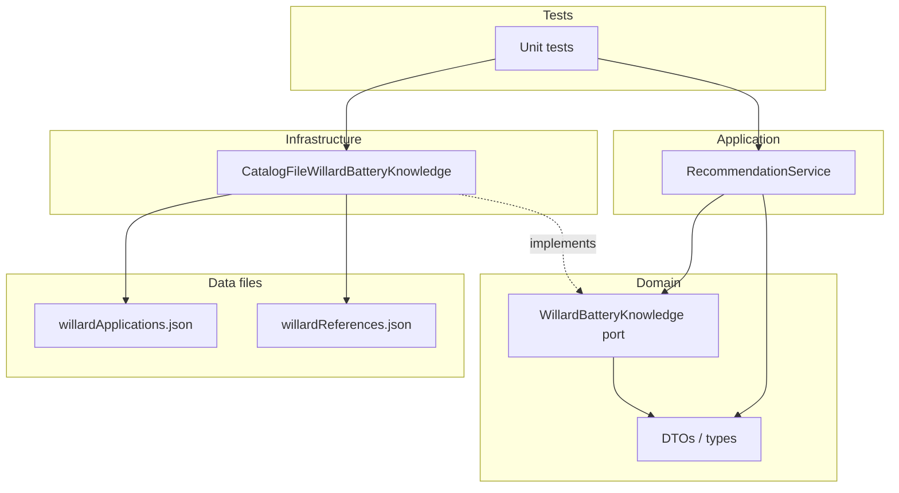
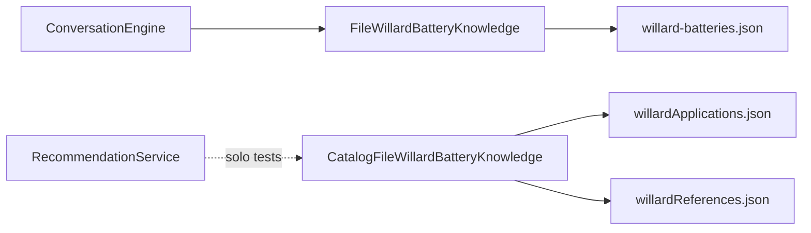

# Willard — Especificación técnica de integración

**Estado:** aprobada (2026-07-29). Implementación pendiente de merge del PR de datos.  
**Fecha:** 2026-07-29.  
**Prerrequisito:** PR de datos `data/willard-catalog-kb` (o equivalente mergeado en `main`).  
**Fuera de alcance de la primera implementación:** cableado a `ConversationEngine`, WhatsApp, inventario, precios, CRM.

Este documento fija el contrato entre:

| Artefacto | Rol |
|---|---|
| `data/willardApplications.json` | Aplicaciones vehículo → referencias por línea |
| `data/willardReferences.json` | Especificaciones técnicas por referencia |
| Puerto `WillardBatteryKnowledge` (evolucionado) | Acceso a conocimiento utilizable |
| `RecommendationService` (nuevo) | Orquestación de búsqueda y recomendación |
| Pruebas unitarias | Validación antes de tocar el chatbot |

Documentos relacionados: `WILLARD_READY_FOR_INTEGRATION.md`, `WILLARD_PENDIENTES.md`, `WILLARD_COBERTURA.md`.

---

## Principios del sistema

Reglas fundamentales de la arquitectura. Guían toda la implementación y cualquier cambio posterior. Si una propuesta las viola, no se implementa sin aprobación explícita.

### P1 — Separación estricta de capas

| Capa | Contiene | No contiene |
|---|---|---|
| **Datos** | JSON de catálogo, imágenes fuente, scripts de validación/cotejo | Reglas de matching, copy de WhatsApp, DI |
| **Dominio** | Puertos, DTOs, tipos, invariantes | `fs`, rutas de archivo, HTTP, WhatsApp |
| **Infraestructura** | Adaptadores que leen JSON / sistemas externos | Reglas de “¿recomendar o derivar a asesor?” |
| **Aplicación** | `RecommendationService` y casos de uso | Lectura de archivos, formateo de mensajes al cliente |
| **Chatbot** | `ConversationEngine`, flows, canal | Conocimiento del layout del JSON Willard |

Dependencias solo hacia adentro: Chatbot → Aplicación → Dominio ← Infraestructura. Los datos son leídos únicamente por infraestructura.

### P2 — El catálogo impreso es la fuente de verdad

- No inventar referencias, polaridades, modelos ni celdas vacías.
- No reasignar valores entre filas por inferencia.
- Conservar literales del catálogo (`textoCatalogo`, refs con `(2)`, sufijos).
- Toda aplicación expuesta debe poder trazarse a `fuente.imagen` + `fuente.fila`.

### P3 — Seguridad ante datos no cotejados

- `revisionPendiente: true` **nunca** entra en resultados de búsqueda ni recomendación.
- El filtrado ocurre en el adaptador de infraestructura (y puede revalidarse en aplicación).
- Preferir `outcome: empty` / handoff a asesor antes que recomendar un dato dudoso.

### P4 — Datos, lógica y canal son desplegables por separado

- Un PR de datos no cambia `src/`.
- Un PR de integración de conocimiento no cablea el chatbot hasta que se apruebe explícitamente.
- El canal (WhatsApp / `ConversationEngine`) consume puertos; no parsea JSON de catálogo.

### P5 — Contratos explícitos sobre atajos

- Ampliar el puerto con métodos nuevos; no sobrecargar el API legado (`findRecommendations`) como fachada del catálogo estructurado mientras el chatbot siga en el JSON antiguo.
- Outcomes tipados (`matched` / `empty` / `partial`) y `reasonCode` estables; no depender de strings de UI.
- Spec ausente (`spec: null`) no elimina la opción de catálogo.

### P6 — Alcance cerrado por especificación

- No añadir inventario, precios, CRM, alias de marca, ni wiring de WhatsApp sin consultar.
- No “mejorar” el matching con heurísticas no documentadas aquí.
- Ante duda entre velocidad y pureza de capas, prevalece la pureza.

### P7 — Pruebas antes que cableado

- La integración se demuestra primero con pruebas unitarias y fixtures.
- El runtime de producción puede seguir en `willard-batteries.json` hasta el PR de wiring.
- Todo caso de uso de esta spec (UC-01…UC-10) debe tener cobertura de test antes de merge de la rama de implementación.

### P8 — Extensibilidad sin contaminar el núcleo

- Inventario, precios y CRM se enchufan como puertos adicionales o post-procesos sobre `RecommendationResult`.
- No embeber stock ni precio en `willardApplications.json`.
- El núcleo Willard permanece: vehículo/referencia → opciones de catálogo utilizables.

---

## 1. Arquitectura completa

### 1.1 Principio de esta etapa

Separar **datos**, **acceso a conocimiento**, **lógica de recomendación** y **canal conversacional**. En esta etapa solo se construyen las tres primeras capas; el canal permanece en el adaptador legado. Ver también [Principios del sistema](#principios-del-sistema).

### 1.2 Vista lógica (objetivo de la rama de integración)

```text
┌─────────────────────────────────────────────────────────────────┐
│  Canal (FUTURO — no en esta etapa)                              │
│  WhatsApp / HTTP → ConversationEngine → batteryFlow             │
└────────────────────────────┬────────────────────────────────────┘
                             │ (aún usa FileWillardBatteryKnowledge
                             │  + willard-batteries.json)
┌────────────────────────────▼────────────────────────────────────┐
│  Application                                                    │
│  RecommendationService                                          │
│    - interpreta consultas                                       │
│    - aplica reglas de negocio (vacío → asesor)                  │
│    - no lee archivos                                            │
└────────────────────────────┬────────────────────────────────────┘
                             │ depende de
┌────────────────────────────▼────────────────────────────────────┐
│  Domain — puerto WillardBatteryKnowledge (ampliado)             │
│    findByVehicle / findByReference / (legacy findRecommendations│
│    marcado como bridge opcional, no usado por el chatbot aún)   │
└────────────────────────────┬────────────────────────────────────┘
                             │ implementado por
┌────────────────────────────▼────────────────────────────────────┐
│  Infrastructure                                                 │
│  CatalogFileWillardBatteryKnowledge                             │
│    - carga willardApplications.json + willardReferences.json    │
│    - filtra revisionPendiente === true                          │
│    - normaliza e indexa en memoria                              │
└────────────────────────────┬────────────────────────────────────┘
                             │
┌────────────────────────────▼────────────────────────────────────┐
│  Data (solo lectura)                                            │
│  willardApplications.json · willardReferences.json              │
└─────────────────────────────────────────────────────────────────┘
```

### 1.3 Vista de despliegue en esta etapa

- El proceso Node del chatbot **no** cambia de wiring.
- La nueva pila se valida solo con **pruebas unitarias** (y opcionalmente un script de smoke fuera de `src` runtime).
- `container.ts` sigue instanciando `FileWillardBatteryKnowledge` sobre `willard-batteries.json`.

### 1.4 Coexistencia con el legado

| Componente | Estado |
|---|---|
| `data/willard-batteries.json` | Sigue en producción vía chatbot |
| `FileWillardBatteryKnowledge` | Sin cambios en esta etapa |
| `CatalogFileWillardBatteryKnowledge` | Nuevo; solo tests |
| `RecommendationService` | Nuevo; solo tests |
| `ConversationEngine` | Sin cambios |

Un PR posterior (no este) hará el swap en DI y adaptará `batteryFlow` al nuevo DTO.

---

## 2. Responsabilidad de cada capa

### 2.1 Data

- Fuente de verdad del catálogo oficial.
- No contiene reglas de matching ni mensajes al cliente.
- Conserva filas con `revisionPendiente: true` (registro oficial); el filtrado es de runtime.
- Join lógico: campo `referencia` entre aplicaciones y especificaciones.

### 2.2 Domain (puerto + DTOs)

- Define contratos estables para el resto del sistema.
- No conoce rutas de archivo ni JSON.
- No formatea texto WhatsApp.
- Expresa el modelo de dominio Willard: vehículo, línea de producto, referencia, especificación, trazabilidad.

### 2.3 Application (`RecommendationService`)

- Caso de uso: “dado un vehículo o una referencia, ¿qué se puede recomendar?”.
- Aplica reglas:
  - solo conocimiento ya filtrado por el puerto (o reafirma el filtro);
  - sin resultados utilizables → outcome `handoff` / vacío tipado;
  - no inventa referencias ni rellena celdas vacías;
  - no mezcla rodamientos (`ProductRepository`) con baterías.
- Puede enriquecer con specs vía el mismo puerto.
- No hace I/O.

### 2.4 Infrastructure (adaptador de catálogo)

- Lee y parsea los dos JSON.
- Descarta en carga (o en query) todo registro con `revisionPendiente: true`.
- Normaliza strings para matching.
- Resuelve referencia → especificación (match exacto del literal; sin inventar polaridad/`(2)`).
- Loguea fallos de carga; ante fallo, conocimiento vacío (fail-safe).

### 2.5 Presentation / Chatbot (explícitamente excluido)

- `ConversationEngine`, `batteryFlow`, handlers WhatsApp: **no modificados**.
- Preparados conceptualmente para consumir `RecommendationService` en un PR futuro.

---

## 3. Interfaces públicas

Nombres tentativos; la implementación puede ajustar sufijos si el review lo pide, pero el **contrato semántico** queda fijo.

### 3.1 Puerto `WillardBatteryKnowledge` (evolución)

El puerto actual solo expone:

```ts
findRecommendations(query: WillardLookupQuery): WillardBatteryMatch[]
```

con un modelo orientado al JSON legado (`amperage`, `caseType`, `soundSystem`).

**Decisión (ADR-001):** ampliar el puerto con métodos nuevos del catálogo estructurado, y **no** reutilizar `findRecommendations` como API principal del catálogo nuevo. El método legado permanece para no romper `ConversationEngine` hasta el PR de cableado.

Métodos nuevos del puerto:

| Método | Entrada | Salida | Notas |
|---|---|---|---|
| `findApplicationsByVehicle(query)` | marca (req), modelo?, versión? | `WillardApplicationHit[]` | Solo apps utilizables |
| `findApplicationsByReference(reference)` | referencia literal | `WillardApplicationHit[]` | Match en cualquiera de las 4 líneas |
| `findReferenceSpec(reference)` | referencia literal | `WillardReferenceSpec \| null` | `null` si no hay ficha o está pendiente |
| `listProductLinesForApplication(appId)` o embebido en hit | — | líneas + refs | Preferible embebido en el hit |

Opcional (fase 2 del mismo PR de integración, si simplifica tests):

| Método | Rol |
|---|---|
| `getUsableApplicationCount()` | Métrica / health |
| `hasBrand(marca)` | Smoke |

### 3.2 `RecommendationService` (application)

| Método | Rol |
|---|---|
| `recommendByVehicle(query: VehicleRecommendationQuery): RecommendationResult` | Flujo principal vehículo → opciones |
| `recommendByReference(query: ReferenceRecommendationQuery): RecommendationResult` | Flujo referencia → vehículos + spec |
| `lookupReference(reference: string): ReferenceLookupResult` | Solo ficha técnica |

El service **no** expone I/O ni paths.

### 3.3 Qué no es interfaz pública en esta etapa

- Lectura directa de JSON desde application/domain.
- API HTTP nueva.
- Eventos de dominio / bus.
- Alias de marca (`CHANA`↔`CHANGAN`) como API estable (queda como ADR pendiente).

---

## 4. DTOs

### 4.1 Enumeraciones / uniones

```ts
type WillardProductLine =
  | 'willardAgmEfb'
  | 'increibleTitanio'
  | 'willard'
  | 'extrema';

type RecommendationOutcome =
  | 'matched'      // ≥1 aplicación utilizable con ≥1 referencia
  | 'empty'        // sin match usable → el consumidor debe derivar a asesor
  | 'partial';     // match de vehículo pero todas las líneas vacías (raro; tratar como empty en UX)
```

### 4.2 Consultas

```ts
interface VehicleRecommendationQuery {
  marca: string;          // requerido
  modelo?: string;
  version?: string;
  /** Si true, exige coincidencia más estricta de versión cuando se envía. Default: false (versión opcional / soft). */
  requireVersion?: boolean;
  /** Límite de aplicaciones devueltas. Default sugerido: 20. */
  limit?: number;
}

interface ReferenceRecommendationQuery {
  referencia: string;     // literal de catálogo, p.ej. "24BD-850" o "55DD-800 (2)"
  limit?: number;
}
```

### 4.3 Modelo de aplicación (salida)

```ts
interface WillardSourceTrace {
  lote: number;
  imagen: string;
  fila: number;
}

interface WillardLineReferences {
  line: WillardProductLine;
  references: string[];   // literales; arreglo vacío = celda vacía en catálogo
}

interface WillardApplicationHit {
  marca: string;
  categoria: string;
  modelo: string;
  version: string | null;
  textoCatalogo: string;
  lines: WillardLineReferences[];
  fuente: WillardSourceTrace;
  /** Siempre false en resultados del puerto (ya filtrado). */
  revisionPendiente: false;
}
```

### 4.4 Especificación de referencia

```ts
interface WillardDimensionsMm {
  largo: number | null;
  ancho: number | null;
  alto: number | null;
}

interface WillardReferenceSpec {
  referencia: string;
  linea: string;          // texto de lista maestra, p.ej. "Willard AGM"
  polaridad: string | null;
  dimensionesMm: WillardDimensionsMm | null;
  terminal: string | null;
  voltaje: number | null;
  c20Ah: number | null;
  cca18C: number | null;
  ca22C: number | null;
  crMin: number | null;
  notas: string | null;
  fuente: {
    lote: number;
    imagen: string;
    tabla?: string;
    fila: number;
  };
}
```

### 4.5 Opción recomendable (aplicación + línea + spec opcional)

```ts
interface WillardRecommendedOption {
  application: WillardApplicationHit;
  productLine: WillardProductLine;
  reference: string;
  /** null si la ref no está en willardReferences o su ficha está pendiente. */
  spec: WillardReferenceSpec | null;
}
```

### 4.6 Resultado de recomendación

```ts
interface RecommendationResult {
  outcome: RecommendationOutcome;
  query: VehicleRecommendationQuery | ReferenceRecommendationQuery;
  options: WillardRecommendedOption[];
  /** Apps distintas que originaron options (dedupe). */
  applications: WillardApplicationHit[];
  /** Mensaje de máquina, no copy de WhatsApp. Ej: 'NO_USABLE_MATCH'. */
  reasonCode?: string;
}
```

### 4.7 Bridge legado (solo documentación; no implementar en esta etapa)

El DTO actual `WillardBatteryMatch` (`amperage`, `caseType`, `soundSystem`) **no** mapea 1:1 al catálogo nuevo. El PR de cableado futuro definirá un mapper explícito o rediseñará `batteryFlow`. Esta especificación **no** obliga a ese mapper ahora.

---

## 5. Flujo de búsqueda

### 5.1 Normalización

Función única compartida (infrastructure o domain puro):

1. Unicode NFD → quitar diacríticos.
2. Lowercase.
3. Sustituir no alfanuméricos por espacio.
4. Colapsar espacios y trim.

Aplicar a `marca`, `modelo`, `version`, `textoCatalogo` y a la query.

### 5.2 Filtro obligatorio

Antes de cualquier match:

```text
aplicacion.revisionPendiente === true  →  excluida
referenciaSpec.revisionPendiente === true  →  no se expone como spec
```

Las apps pendientes **no aparecen** en ningún resultado de búsqueda.

### 5.3 Búsqueda por vehículo

```text
entrada: marca, modelo?, version?
  → normalizar
  → candidatas = apps utilizables donde normalize(marca) == normalize(app.marca)
  → si modelo:
        score = scoreWillardModelMatch(query.modelo, app.modelo, app.textoCatalogo)
          4 = igualdad normalize/compact en modelo
          3 = igualdad normalize/compact en textoCatalogo
          2 = todos los tokens de query ⊆ tokens de modelo (enteros;
              variante glued letras+dígitos: mazda3 → [mazda, 3])
          1 = todos los tokens de query ⊆ tokens de texto solamente
          null = sin match
        reglas:
          - nunca includes de caracteres ("3" dentro de "cx3")
          - query numérica corta (/^\d{1,2}$/) exige score ≥ 2
        filtrar score != null
  → si version y requireVersion:
        exigir igualdad normalizada con app.version (si app.version es null → no match)
  → si version y !requireVersion:
        preferir (rank) las que coinciden versión; no descartar el resto
  → ordenar: score modelo desc > versionBoost > textoCatalogo A-Z
  → si modelo presente: conservar solo el tier con score máximo (top-tier)
  → aplicar limit
  → devolver WillardApplicationHit[]
```

**Regla:** sin `marca` → error de validación en el service (no búsqueda abierta de todo el catálogo).

**Ambigüedad (service):** si la query trae `modelo` y hay ≥2 `modelo` distintos con firmas de referencias no equivalentes → `outcome=partial`, `reasonCode=AMBIGUOUS_MODEL` (pedir aclaración; no listar baterías). Si todas las firmas son idénticas → `matched` como hoy. Consultas solo-marca sin cambio.

### 5.4 Búsqueda por referencia

```text
entrada: referencia (trim; match exacto del literal normalizado de espacios)
  → candidatas = apps utilizables cuya unión de refs en las 4 líneas contiene la referencia
  → no expandir "24BD-850" ↔ "24BD-850 (2)" automáticamente
  → devolver hits +, en paralelo, findReferenceSpec(referencia)
```

### 5.5 Resolución de especificación

```text
mapa referencia → spec (solo revisionPendiente false)
  → get(referenciaExacta)
  → si falta: spec = null (la opción sigue siendo recomendable por literal de catálogo)
```

No corregir `65-1150` → `65I-1150` en runtime.

---

## 6. Flujo de recomendación

### 6.1 `recommendByVehicle`

```text
1. Validar query (marca no vacía).
2. apps = knowledge.findApplicationsByVehicle(query).
3. Si apps.length === 0:
     return { outcome: 'empty', options: [], applications: [], reasonCode: 'NO_USABLE_MATCH' }
4. Para cada app, por cada línea, por cada referencia no vacía:
     options.push({ application, productLine, reference, spec: knowledge.findReferenceSpec(reference) })
5. Si options.length === 0:
     return { outcome: 'partial'|'empty', reasonCode: 'VEHICLE_MATCH_WITHOUT_REFERENCES' }
6. return { outcome: 'matched', options, applications: apps }
```

El service **no** elige “la mejor” batería comercial (precio, stock). Devuelve el abanico de líneas del catálogo. La priorización comercial es futura (inventario/precios).

### 6.2 `recommendByReference`

```text
1. Validar referencia no vacía.
2. apps = knowledge.findApplicationsByReference(referencia).
3. spec = knowledge.findReferenceSpec(referencia).
4. Construir options solo para la referencia pedida sobre esas apps.
5. empty si no hay apps (aunque exista spec huérfana → reasonCode 'SPEC_WITHOUT_APPLICATIONS' o viceversa).
```

### 6.3 Derivación a asesor (contrato semántico)

| Condición | `outcome` | Consumidor futuro (chatbot) |
|---|---|---|
| Sin apps utilizables | `empty` | Handoff a asesor |
| Apps sin ninguna ref | `partial` / `empty` | Handoff |
| Match con options | `matched` | Listar opciones (copy futuro) |

En esta etapa los tests asiertan `outcome` y `reasonCode`, no texto de WhatsApp.

### 6.4 Independencia del flujo conversacional actual

El flujo actual (`vehicle` → `year` → `soundSystem` → `findRecommendations`) **no** se reproduce aquí. El catálogo nuevo no modela `soundSystem` ni rangos de año. Esos slots del chatbot se re-diseñarán en el PR de cableado.

---

## 7. Diagrama de dependencias

### 7.1 Dependencias permitidas (esta etapa)



### 7.2 Dependencias prohibidas

```text
RecommendationService  ✗→  fs / path / JSON files
RecommendationService  ✗→  ConversationEngine / WhatsApp
Domain                 ✗→  Infrastructure
Catalog adapter        ✗→  RecommendationService
Chatbot (sin cambio)   ✗→  Catalog adapter (aún)
```

### 7.3 Estado del proceso en runtime (sin swap)



---

## 8. Casos de uso

### UC-01 — Recomendar por marca + modelo (feliz)

- **Dado** BMW + `320i` en catálogo utilizable  
- **Cuando** `recommendByVehicle({ marca: 'BMW', modelo: '320i' })`  
- **Entonces** `outcome = matched`, options incluyen refs literales (p.ej. `W-L5-95AH`, `49-1200`), specs donde existan

### UC-02 — Ignorar `revisionPendiente`

- **Dado** una app CHEVROLET marcada pendiente con el mismo modelo que una utilizable (o solo pendiente)  
- **Cuando** se busca ese vehículo  
- **Entonces** las filas pendientes no aparecen; si solo había pendientes → `empty`

### UC-03 — Marca sin modelo

- **Dado** marca `HINO`  
- **Cuando** `recommendByVehicle({ marca: 'HINO' })`  
- **Entonces** lista acotada por `limit` de aplicaciones HINO utilizables

### UC-04 — Versión opcional vs requerida

- **Dado** ALFA ROMEO `159` versiones `2.2` y `3.2`  
- **Cuando** query con `version: '2.2'` y `requireVersion: true`  
- **Entonces** solo la fila 2.2  
- **Cuando** sin `requireVersion`  
- **Entonces** pueden devolverse ambas con ranking favoreciendo 2.2

### UC-05 — Búsqueda por referencia

- **Dado** referencia `NS40D PD 670`  
- **Cuando** `recommendByReference`  
- **Entonces** apps utilizables que la citan (p.ej. CHANA/HAFEI/Alto) + spec si existe

### UC-06 — Referencia huérfana de ficha

- **Dado** `49-1200` citada en apps pero ausente o incompleta en `willardReferences`  
- **Cuando** se recomienda  
- **Entonces** option con `spec: null` (no se omite la recomendación de catálogo)

### UC-07 — Sin match → asesor

- **Dado** marca inventada `ZZZZ`  
- **Cuando** recommend  
- **Entonces** `outcome = empty`, `reasonCode = NO_USABLE_MATCH`

### UC-08 — Celda vacía no se inventa

- **Dado** app con solo Extrema poblada  
- **Cuando** recommend  
- **Entonces** options solo de Extrema; no se copian refs de otras líneas ni de filas vecinas

### UC-09 — Literal `(2)`

- **Dado** ref `55DD-800 (2)` en una app utilizable  
- **Cuando** búsqueda por esa cadena exacta  
- **Entonces** match; búsqueda por `55DD-800` **no** implica automáticamente la variante `(2)`

### UC-10 — Trazabilidad

- **Dado** cualquier hit  
- **Entonces** `fuente.imagen` y `fuente.fila` presentes y coherentes con el JSON

---

## 9. Estrategia de pruebas

### 9.1 Herramienta

Introducir **Vitest** (o el runner que se acuerde en el PR) con TypeScript. Hoy el repo no tiene suite; este PR la inaugura solo para Willard.

Scripts sugeridos en `package.json` (implementación futura):

- `test` — unitarios  
- `test:willard` — filtro del dominio Willard  

`typecheck` existente debe seguir pasando.

### 9.2 Pirámide en esta etapa

| Nivel | Qué | Dónde |
|---|---|---|
| Unit — normalización / matching | Funciones puras | `*.test.ts` junto a módulo o en `tests/` |
| Unit — adaptador con fixtures | JSON mínimos en `tests/fixtures/willard/` | No usar el catálogo completo de 744 filas en cada test |
| Unit — `RecommendationService` | Fake/in-memory del puerto | Aísla reglas de outcome |
| Integración ligera (opcional) | Adaptador + subset real exportado | 1–2 tests de humo; no obligatorios para merge |

**No** en esta etapa: e2e WhatsApp, tests de `ConversationEngine` con el catálogo nuevo.

### 9.3 Fixtures mínimas

Archivo ejemplo `tests/fixtures/willard/apps-mini.json`:

- 1 app utilizable BMW 320i  
- 1 app pendiente misma marca (para probar filtro)  
- 1 app CHANA solo Extrema  
- 1 app con ref `(2)`  
- 1 app con celda vacía en AGM  

`refs-mini.json`:

- Spec para una ref presente  
- Sin entrada para `49-1200` (huérfana)

### 9.4 Criterios de merge del PR de integración

- [ ] Todos los UC-01…UC-10 cubiertos por al menos un test  
- [ ] Ningún test depende de red  
- [ ] `src/application/services/ConversationEngine.ts` sin diff  
- [ ] `src/infrastructure/di/container.ts` sin diff (o solo comentarios)  
- [ ] `npm run typecheck` OK  

### 9.5 Datos de producción en CI (opcional)

Job opcional: `node scripts/validar-willard.mjs` sobre los JSON reales (ya existe). No sustituye unitarios del adaptador.

---

## 10. Riesgos

| ID | Riesgo | Impacto | Mitigación |
|---|---|---|---|
| R1 | Recomendar filas `revisionPendiente` | Batería incorrecta | Filtro en adaptador + test UC-02 |
| R2 | Chevrolet / Ford con baja cobertura usable | Muchos `empty` → asesor | Esperado; documentar en copy futuro |
| R3 | Refs sin ficha (`49-1200`, `65-1150`, `(2)`) | Spec null | Permitido; no bloquear option |
| R4 | Matching substring demasiado laxo | Falsos positivos entre modelos | Tests de precisión; rank + limit; revisar heurística en review |
| R5 | Doble fuente en runtime tras cableado prematuro | Respuestas inconsistentes | Esta etapa no toca DI |
| R6 | Naming `CHANA`/`CHANGAN`, `CHERRY`/`CHERY` | Búsquedas incompletas | Alias en fase posterior (ADR-004) |
| R7 | Confundir puerto legado y nuevo | Regresiones chatbot | Mantener `findRecommendations` intacto; API nueva con nombres distintos |
| R8 | Fixtures desalineadas del JSON real | Falsa confianza | 1 smoke opcional contra subset real |
| R9 | Normalización que rompe `NS40D PD 670` vs `NS40D-PD 670` | Misses | Match de referencia por literal de celda; no sobre-normalizar guiones en refs |
| R10 | Scope creep (WhatsApp, precios) | Retraso | Checklist de fuera de alcance en el PR |

---

## 11. Decisiones de diseño (ADR)

### ADR-001 — Ampliar el puerto; no reutilizar `findRecommendations` como API del catálogo nuevo

- **Contexto:** el DTO legado (`soundSystem`, `amperage`, `caseType`) no existe en el catálogo estructurado.  
- **Decisión:** métodos nuevos (`findApplicationsByVehicle`, etc.). Legado intacto hasta PR de cableado.  
- **Consecuencia:** dos caminos temporales; claridad > abstracción prematura.

### ADR-002 — Filtrar `revisionPendiente` en el adaptador (infraestructura)

- **Contexto:** la regla de negocio está escrita en el JSON (`reglaDeConsumo`).  
- **Decisión:** el adaptador nunca indexa/apps pendientes; el service asume conocimiento ya limpio y puede revalidar en defensiva.  
- **Consecuencia:** imposible “olvidar” el filtro en un use case nuevo que use el mismo puerto.

### ADR-003 — `RecommendationService` no formatea mensajes ni elige stock/precio

- **Contexto:** inventario y CRM vendrán después.  
- **Decisión:** el service devuelve opciones estructuradas + `outcome`.  
- **Consecuencia:** el chatbot futuro (o un `BatteryResponseFormatter`) es otra capa.

### ADR-004 — Sin alias de marca en la v1 de integración

- **Contexto:** `CHANA`/`CHANGAN` etc. son decisiones de negocio abiertas.  
- **Decisión:** matching literal de `marca` normalizada; alias = cambio futuro de datos o mapa configurable.  
- **Consecuencia:** el cliente debe usar la forma del catálogo (o el canal hará NLU después).

### ADR-005 — Referencias literales; sin corrección automática de polaridad ni `(2)`

- **Contexto:** huérfanas y variantes documentadas en pendientes.  
- **Decisión:** no inferir `65I-1150` desde `65-1150`; no strip de `(2)` en el índice principal.  
- **Consecuencia:** specs pueden ser `null`; matching por referencia es exacto.

### ADR-006 — Fixtures para unitarios; catálogo completo solo en validación de datos

- **Contexto:** 744 filas hacen tests frágiles y lentos.  
- **Decisión:** mini JSON en `tests/fixtures`.  
- **Consecuencia:** cobertura de lógica ≠ cobertura de datos (esta última ya la dan `validar-willard` / informes).

### ADR-007 — No cablear DI ni ConversationEngine en el PR de integración

- **Contexto:** el usuario exige pruebas primero y chatbot intacto.  
- **Decisión:** PR verde = tipos + implementaciones + tests; runtime de producción igual.  
- **Consecuencia:** hace falta un PR “wiring” posterior explícito.

### ADR-008 — Join apps↔refs solo por string `referencia`

- **Contexto:** los archivos ya se diseñaron así.  
- **Decisión:** sin IDs sintéticos adicionales en v1.  
- **Consecuencia:** colisiones de homónimos entre líneas se resuelven por contexto de `productLine` en el option.

---

## 12. Preparado para futuras integraciones

Esta etapa deja **puertos y resultados tipados** listos para enchufar otros sistemas sin reescribir el núcleo Willard.

### 12.1 Inventario

| Necesidad futura | Gancho preparado |
|---|---|
| Stock por referencia | `WillardRecommendedOption.reference` como clave de join |
| Filtrar sin stock | Decorator del puerto o paso en `RecommendationService` que consulte `InventoryPort` |
| Doble batería `(2)` | Campo futuro `cantidad` derivado del literal; hoy el literal se conserva |

**Puerto futuro sugerido:** `InventoryPort.getAvailability(reference): StockLevel`.

### 12.2 Precios / lista comercial

| Necesidad | Gancho |
|---|---|
| Precio por referencia o por línea | Enriquecer options en un `PricingPort` |
| Ordenar por margen | Post-proceso sobre `RecommendationResult.options` sin tocar el catálogo |

No mezclar precio dentro de `willardApplications.json`.

### 12.3 CRM

| Necesidad | Gancho |
|---|---|
| Registrar recomendación hecha | `RecommendationResult` serializable + `fuente` para auditoría |
| Ticket cuando `outcome = empty` | `reasonCode` estable (`NO_USABLE_MATCH`, …) |
| Vehículo del cliente | Query tipada (`marca`/`modelo`/`version`) alineada a campos CRM |

**Puerto futuro:** `CrmPort.createHandoff({ reasonCode, query, partialOptions })`.

### 12.4 WhatsApp / ConversationEngine

| Necesidad | Gancho |
|---|---|
| Sustituir conocimiento legado | `container.ts`: inyectar `RecommendationService` o adaptador que implemente un bridge |
| Formateo de respuesta | Nuevo formatter que consuma `WillardRecommendedOption[]` (reemplazo de `formatBatteryRecommendation`) |
| Slots year / soundSystem | Re-diseño del flow; el catálogo nuevo no los tiene — no forzar campos inventados |
| Handoff | Mapear `outcome === 'empty'` al handoff existente |

Secuencia recomendada de PRs futuros:

1. **Wiring interno** — DI + bridge opcional detrás de flag.  
2. **UX WhatsApp** — copy de líneas AGM/Titanio/Willard/Extrema.  
3. **Inventario/precios** — filtros comerciales.  
4. **CRM** — handoff enriquecido.

### 12.5 Extensiones de datos

| Extensión | Cómo encaja |
|---|---|
| Lote 2 del catálogo | Append a JSON + mismos DTOs |
| Alias de marca | Archivo `willardBrandAliases.json` o campo en apps; ADR-004 |
| Normalización `(2)` | Migración de datos + tests de compatibilidad |
| Multidioma | `textoCatalogo` permanece literal; copy en formatter |

### 12.6 Lo que esta especificación garantiza como estable

- Separación datos / puerto / service / canal.  
- Filtro `revisionPendiente`.  
- Búsqueda por marca, modelo, versión, referencia.  
- Trazabilidad `fuente`.  
- Outcomes explícitos para handoff.  
- Independencia de WhatsApp en el núcleo.

---

## Apéndice A — Alcance del PR de implementación (checklist)

**Incluye**

- [ ] DTOs + puerto ampliado  
- [ ] `CatalogFileWillardBatteryKnowledge`  
- [ ] `RecommendationService`  
- [ ] Vitest (o runner acordado) + fixtures + UC-01…UC-10  
- [ ] Este documento referenciado desde el PR  

**No incluye**

- [ ] Cambios a `ConversationEngine` / `batteryFlow` / `container.ts` (salvo lo estrictamente necesario y aprobado)  
- [ ] Modificación de `willardApplications.json` / imágenes  
- [ ] Alias de marca, inventario, precios, CRM, WhatsApp  
- [ ] Eliminación de `willard-batteries.json`

---

## Apéndice B — Criterio de aprobación de esta especificación

**Aprobada el 2026-07-29**, incluyendo el apartado [Principios del sistema](#principios-del-sistema).

Tras el merge del PR de datos se crea la rama `feat/willard-knowledge-integration` y se implementa **solo** lo del Apéndice A, respetando P1–P8.
